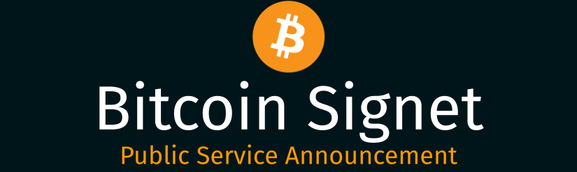

[](https://bitcoinsignet.com/)

<div style="text-align:center"><span style="color:orange"><strong>Coins from the Bitcoin Signet network are intentionally worthless.</strong></span></div>

<br/>

Bitcoin Signet is a test Bitcoin network, used for testing and educational purposes. This is a feature of Bitcoin, not a bug.

If you're being offered "Free" or "Discount" bitcoin and promised they are real bitcoin, they may be worthless Bitcoin Signet coins.
You may be cheated for your time and/or money. Be wary.

The remainder of this page will provide some basic guidelines and links to more information.

<br/>
## Basic Guidelines

All of the below numbered steps are necessary, none are optional.

```
Symbol Legend

✅  This is a necessary check for your safety.
🚩  This is a red flag. It should not occur.
⚠️  This is a caveat or precautionary statement.
```
<br/>
### 1. Always decide and download your Bitcoin Wallet for yourself

Bitcoin wallets can be repackaged to work with Bitcoin Signet. This is a feature not a bug.

Such wallets may behave similar to wallets with real bitcoin.

Always know which wallet you are using and why.

✅ Determined the wallet's official URL using a search engine like Google, Bing, DuckDuckGo.

✅ Downloaded the wallet from its official URL or App stores like the Android and IOS App store.

✅ The wallet is open source and a publicly visible project with activity on [Github](https://github.com) or [Gitlab](https://gitlab.com).

✅ Confirmed that the Website or App is published and owned by the original authors and developers.

✅ Confirmed that the software version matches that of a recent stable release, and signed by the authors and developers.

🚩 Obtained a URL or app to a wallet software from someone else.

🚩 Downloaded or using a wallet that someone else provides to you.

🚩 The wallet is not an open source project.

🚩 The open source project is recent with little or no activity

⚠️ This is not sufficient since your network can be compromised and the above checks can be faked. Follow up with step 2 and step 3 described below.

<br/>
### 2. Check the address format

Learn what real bitcoin addresses look like.

When sending bitcoin or receiving them yourself, the bitcoin address will begin with a valid prefix. If you are sending or receiving to an address without this prefix, then 
you are not dealing with actual bitcoin.

✅ The bitcoin address can be viewed.

✅ The wallet lets you generate many different addresses that look different.

✅ All addresses start with ```1``` or ```2``` or ```bc1```.

🚩 You cannot see the bitcoin address on your wallet.

⚠️ This is not sufficient since a compromised wallet can show you legit addresses but do something else in the background. Proceed to step 3 described below.

<br/>
### 3. Test a small transaction and verify it on a well known Explorer

Always run a test transaction with an insignificant amount. Wait for a minimum of 2 confirmations before proceeding to the intended & final transaction.

✅ A small insignificant transaction was successfully confirmed on the Mainnet on more than 1 block explorer. Here's a few you can use: 
[Mempool](https://mempool.space/), [Blockstream](https://blockstream.info/), [Bitcoin Explorer](https://bitcoinexplorer.org/), [BlockCypher](https://live.blockcypher.com/btc/)

✅ The next transaction with the intended amount has the exact same workflow as the test transaction and there are no changes needed.

🚩 You are asked to confirm the transaction on an unknown/lesser-known block explorer.

🚩 You are asked to confirm the transaction by selecting the Signet or Testnet network.

🚩 You are asked to restart the wallet software or regenerate a new wallet or create a new address to perform the intended & final transaction.

⚠️ If any of the above red flags occur, stop and do not perform the intended & final transaction


<br/>
## Links to Bitcoin Signet on the web

| Resource                                                   | Description                                                                                                                                                          | 
|------------------------------------------------------------|----------------------------------------------------------------------------------------------------------------------------------------------------------------------|
| [Bitcoin Signet](https://en.bitcoin.it/wiki/Signet)        | Bitcoin Signet wiki entry                                                                                                                                            |
| [BIP 0325](https://en.bitcoin.it/wiki/BIP_0325)            | The BIP entry describing Bitcoin Signet                                                                                                                              |
| [Signet Faucet](https://signetfaucet.com/)                 | Grab some free signet bitcoin here. Remember: They are worthless                                                                                                     |
| [Signet is Worthless](https://signetfaucet.com/worthless)  | Similar to this page, maintained by [Kalle Alm](https://twitter.com/kallewoof), Bitcoin Core contributor and Author of Signet                                        |
| [Signet Explorer](https://mempool.space/signet)            | Signet explorer                                                                                                                                                      |
| [Explaining Signet](https://youtu.be/lGJaIbpf6bk)          | A helpful discussion on Youtube that dives into Bitcoin Signet                                                                                                       |

<br/>
## Contributions

If you would like to help keep this page updated, please contact me.

🏗️ Found something that needs correction or editing?

⚡ Update this page with instructions of how to be safe on Lightning Network.

<br/>
## Contact & Acknowledgements

*   [Twitter](https://twitter.com/readysatoshi)
*   [Email](mailto:admin@bitcoinsignet.com)
*   [Github](https://github.com/readysatoshi/bitcoinsignet)  
*   [Theme Credit](https://bitcoiner.guide/)